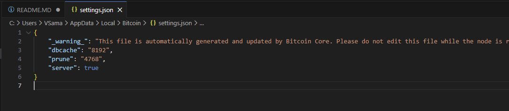
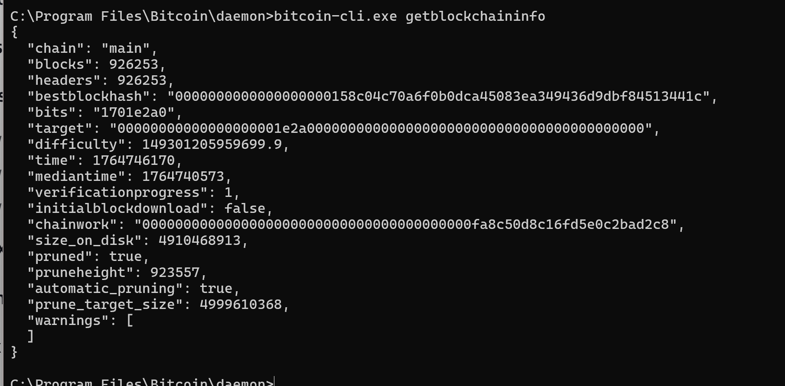
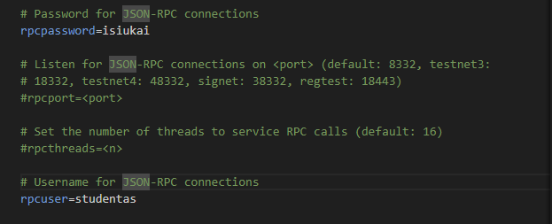
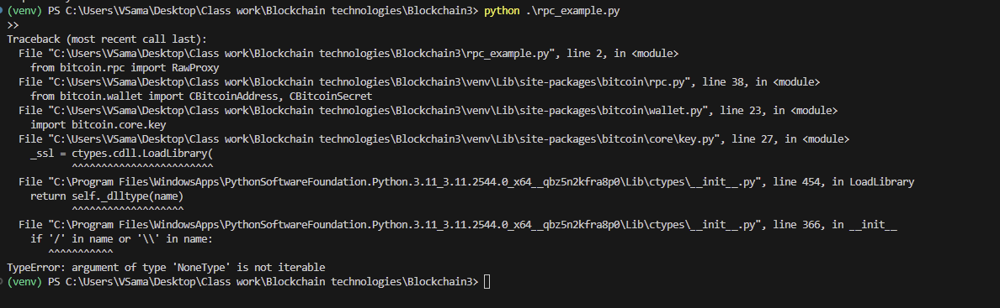

# **1 dalis: Libbitcoin instaliavimas**

Iš pradžių buvo bandyta per WSL Ubuntu, tačiau kilo problemų dėl nesuderinamų Boost versijų. Tad naudojau savo paruoštą VM su Docker, per kurią sukūriau konteinerį senesniu Ubuntu pagrindu ir visiškai "švariu" environment.

Panaudojus šias komandas, sėkmingai instaliavau libbitcoin:

```bash
apt update
apt install -y build-essential autoconf automake libtool pkg-config git wget
wget https://raw.githubusercontent.com/libbitcoin/libbitcoin/version3/install.sh
chmod +x install.sh
./install.sh --prefix=/usr/local --build-boost --disable-shared
```
Taip pat reikejo paleisti komanda: ```export PKG_CONFIG_PATH=/usr/local/lib/pkgconfig```


Tai atlikus buvo sukurtas merkle.cpp failas, taciau reikejo pakeisti headeri is bitcoin.hpp i system.hpp

Galiausiai kompiliavau ir testavau kodą (naudojau g++, taip pat naujesnė versija naudoja pkg-config „libbitcoin-system“):
```g++ -std=c++11 merkle.cpp -o merkle $(pkg-config --cflags --libs libbitcoin-system)```


Deja, bet mano grupės 2 užduotis buvo programuota Python kalba, tad tiesioginė integracija nebuvo įmanoma, nes pateikta programa įgyvendinta C++.

# **2 dalis: Pilno Bitcoin mazgo (Bitcoin Core) įdiegimas**
Iš pradžių Bitcoin Core diegiau atskirame Docker konteineryje. Kiti galėtų pasiekti per 8332 portą.

Konteinerio paleidimas:
```
docker run -d \
  --name bitcoin-core \
  -p 8332:8332 \
  -p 8333:8333 \
  -v bitcoin-data:/bitcoin/.bitcoin \
  ruimarinho/bitcoin-core:latest \
  -server=1 \
  -prune=550 \
  -rpcallowip=0.0.0.0/0 \
  -rpcuser=student \
  -rpcpassword=student123 \
  -txindex=0
```
Deja, mano VM neturėjo pakankamai vietos šiam konteineriui. Kadangi instaliacija truko ilgai, nusprendžiau antrą kartą instaliuoti per native Windows Bitcoin Core installerį.

Instaliavau naudojant prune režimą, taupant atmintį. Taip pat nustačiau database cache į 8GB bei įjungiau RPC serverio režimą. Taip kiti žmonės galės prisijungti per 8332 portą. Tam taip pat reikėjo sukonfigūruoti config failą (Šiuo metu testavimui allowed IP padariau tik localhost loopback'ą, bet norint galima ir pridėti kitų leistinų asmenų IP, user=studentas, pass=isiukai)





# **3 dalis: Bitcoin  tinklo analizė su python-bitcoinlib**

Pasirinkau daryti per VU bitcoin node. Prisijungus per WSL terminalą, sukūriau aplanką darbui ir įsikėliau duotas programas.

Tačiau iškilo problema - nors rašoma, kad instaliuota, panašu, kad python-bitcoinlib nebuvo mano aplinkoje. Mano idėja buvo sukurti venv ir suinstaliuoti pačiam, taip nepaveikiant visos aplinkos, tačiau venv kūrimas taip pat buvo negalimas, todėl negalėjau tęsti užduoties.

Su savo nuosavu node nepavyko atlikti užduoties dėl sudėtingų environment problemų.




Vis tiek pabandžiau parašyti programas 3 ir 4 užduotyse, bet negaliu patikrinti, ar jos veikia gerai dėl aukščiau aprašytų problemų.
### Trasnsakcijos mokestis
```
# transaction_fee.py
from bitcoin.rpc import RawProxy

# Replace with your RPC username/password if needed:
p = RawProxy()
def get_tx_fee(txid):
    # Pasiimame transakcijos duomenis
    tx = p.getrawtransaction(txid, True)

    # inputs sum
    input_sum = 0
    for vin in tx["vin"]:
        parent_txid = vin["txid"]
        parent_vout = vin["vout"]

        parent_tx = p.getrawtransaction(parent_txid, True)
        input_sum += parent_tx["vout"][parent_vout]["value"]

    # outputs sum
    output_sum = sum(v["value"] for v in tx["vout"])

    # fee calc
    fee_btc = input_sum - output_sum

    return fee_btc


# Testas su duota transakcija
txid = "b6f6991d06c43753c3cda4e04e48e0ba449b752e0e8087cbdeb18f0a0e5f39f2"  # replace if needed
fee_btc = get_tx_fee(txid)

print(f"Transakcijos mokestis: {fee_btc} BTC")
```
### Bloko hasho patikra
```
# check_block_hash.py
from bitcoin.rpc import RawProxy
import hashlib
import struct

p = RawProxy()

def double_sha256(data):
    return hashlib.sha256(hashlib.sha256(data).digest()).digest()

def calculate_block_hash(header):
    hash_raw = double_sha256(header)
    return hash_raw[::-1].hex()  # reverse for big-endian (display format)

def get_block_header_bytes(block):
    version = struct.pack("<I", block["version"])
    prev_hash = bytes.fromhex(block["previousblockhash"])[::-1]
    merkle_root = bytes.fromhex(block["merkleroot"])[::-1]
    time = struct.pack("<I", block["time"])
    bits = struct.pack("<I", block["bits"])
    nonce = struct.pack("<I", block["nonce"])
    return version + prev_hash + merkle_root + time + bits + nonce

height = input("Input height: )
blockhash = p.getblockhash(height)

block = p.getblock(blockhash)
header = get_block_header_bytes(block)

computed_hash = calculate_block_hash(header)

print("Tikras hash: ", blockhash)
print("Apskaičiuotas: ", computed_hash)

if computed_hash == blockhash:
    print("Teisingai")
else:
    print("Neteisingai")
```